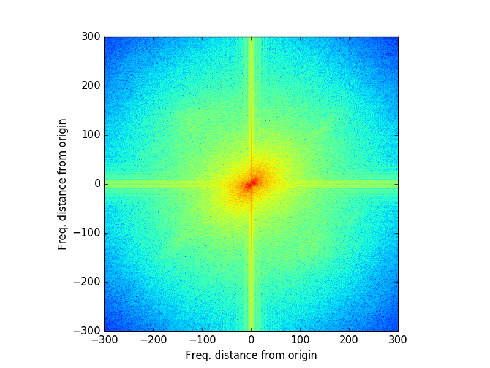

# LFMapper (Linear Feature Mapper)

## Usage

1. Ensure that you have all of the packages available and visible to python listed [here](#dependencies-and-other-details);

2. Use nosetests to run [tests.py](./tests/tests.py) to make sure everything runs on your machine - this should be run from the top directory (just type `nosetests`);

3. Run one of the driver scripts (for either [ENVI](./EXAMPLE_ENVI.py) and [JPG](./EXAMPLE_JPG.py) file types) - these are basic examples of how to calculate spacing and orientation of images using various step and kernel sizes - the outputs will be available in tests/test_output on your machine, in a folder with either ENVI or JPG along with ENVI or JPG in the name. Call the scripts from the top directory using:

		python EXAMPLE_ENVI.py
		python EXAMPLE_JPG.py

4. For more info on exactly how the program works, keep reading...

## About

LFMapper (Linear Feature Mapper) is a program that extracts the mean orientation and spacing of linear features from images using a Fourier Transform approach. It is built using Python v2.7 (not currently v3. compatible) . The program has been developed with images of topography in mind (any brightness type image will work - from digital elevation models (DEMs) to hyperspectral imagery). The program has been built in collaboration between [Chris Williams](https://github.com/Chris35Wills) (main program development) and [Martin O'Leary](https://github.com/mewo2) (implementation of convolution, display and interpretation of fourier transform output and smoothing). 

The ultimate output is the ability to quantify additional data from images than was available before - in this case, values for spacing and orientation as displayed in the quiver plot, created using this program, following analysis of the input DEM on the left:

## Motivation

The development of this program was inspired for use in glaciological research, allowing for the mapping of crevasse features across glacier surfaces. Today, an unprecedented amount of image data is available of glaciers across the globe. Despite this surge in data availability, tools to analyse these data to acquire useful information are comparatively sparse. The mapping of crevasse features is useful in particular for the validation of crevasse damage model outputs, consideration of crevasse evolution which can be monitored through repeat imagery of glacier test sites (Colgan et al., [2011](http://onlinelibrary.wiley.com/doi/10.1029/2011GL048491/full)), and for assessment of the effects of crevasse distribution and evolution on the calving process (Benn et al., [2007a](https://stuff.mit.edu/~heimbach/papers_glaciology/earthscirev_benn_etal_2007_calving.pdf), [2007b](https://risweb.st-andrews.ac.uk/portal/en/researchoutput/calving-laws-sliding-laws-and-the-stability-of-tidewater-glaciers(6b9dec0b-8f58-4ea6-9768-b983353d54bb).html)) - one of the remaining enigmas clouding our understanding of tidewater glaciers.

Despite the initial glaciological focus, the program is by no means tuned to glacier images! Any image that contains linear features that you wish to summarise can be considered, whether this of a 2-dimensional sine wave, the mean spacing and orientation of the stripes on a zebra, the weave of a piece of fabric, sand dune distribution from an image of a desert... or pretty much anything else that is dominated by linear features!

## How it works

A moving window is iterated over a provided image, each iteration focusing on a small subset of the original image. Such an image might be like this (a section of a DEM of a crevassed glacier surface):

Using the Fourier Transform functionality provided in Python's [scipy package](http://docs.scipy.org/doc/scipy/reference/fftpack.html), each sub-image is transformed into frequency space to allow an analysis of the various frequency components of the image: 

The frequency space image is smoothed to remove artefacts introduced as a function of the square nature of the image being analysed (see [Moisan et al., 2011](http://www.math-info.univ-paris5.fr/~moisan/papers/2009-11r.pdf) for more details and [this module](https://github.com/mewo2/smoothfft) written by [Martin O'Leary](https://github.com/mewo2)):

The image then has noise removed (user set):

and magnitude is then logged: 

A zoom of the above image shows the peaks as the red dots:

The maximum peak in frequency space is then selected, its spacing and orientation being calculated relative to the origin (in this case, the middle) of the frequency space plot). 

New grids are then populated by these spacing and orientation values, each pixel representative of the results of the analysis of one window iteration. If geospatial data are passed in, these output grids are converted to match the initial geospatial extent of the inputs, enabling seamless integration into any geospatial work-flow or modelling application. More information on the outputs can be found below.

## User settings

The program relies on the user setting specific variables. 

The **window size** (defined by the variable *kernel_range* and which can be a list of values which the programme will then iterate through)
must be odd (you'll be told if this is not the case) - the values to use for this are important and must ultimately define a window size that will be large enough to capture repeated instances of wavelengths which you are interested in - for example, for an image where you know there is a dominant wavelength of 2 m, go for a window size that is about 11 x 11 m as this will allow for the identification of a strong peak due to ~5 repeats of the signal within the window's extent. This is discussed in more detail below. 

The **step size** (defined by the variable *step_range* and which can be a list of values which the programme will then iterate through) sub-sample the image. A step size of 1 will result in a sub-image of dimensions set by *kernel_range* every pixel (this will take a while) - the larger the step size, the faster the run but the less detailed the result. The *best* step size is based on the distance over which a signal likely dominates. If you know one signal dominates the whole image, then a large step size will be adequate. Analysis of an image with varying linear features across it will benefit from a program run using a smaller step size. It is best to supply the program with a range of step sizes as you can then consider the results from each run separately.

Depending on your image type, you may or may not want to **remove noise**. The type of noise to remove from an image can be set by defining the *spectrum_n* variable in the driver scripts. This value represents a power law (e.g. a value of 2 is representative of brown noise) which will be used to flatten the frequency spectrum. For more info on noise, see [here](https://en.wikipedia.org/wiki/Colors_of_noise).

### Finding the right window size

Mean spacing and orientation is achieved through a moving window approach across the image. The size of the search window (or kernel) selected is instrumental in the wavelengths of features that will be characterised. One way to assess this is to take a square sample of the image and starting at the central pixel, iteratively enlarge a search window (i.e. 1st iteration: 1x1 | 2nd iteration: 3x3 | 3rd iteration: 5x5 etc.), each iteration assessing the spacing of features. This can be visualised as:

These spacings and orientations can then be plotted - what you are looking for is a window size that captures features you are looking for (i.e. of a certain wavelength) OR if you know nothing about the image, in an xy plot of frequency spacing (wavelength) against window size, a good window to start with would be that where over multiple iterations, wavelength doesn't change much. For the below plot, useful window sizes to begin with would be between 300 - 700 m as this is where feature spacing changes little (therefore potentially indicative of a stable wavelength to map).

There is a BETA program that can calculate and plot these data - please post an issue if you are interested. This will be integrated into the main code in the near future.

## Program structure and basic use

The core functionality of the program is bundled into the [crevassemap module](./crevassemap) with example driver scripts for working with [ENVI](./EXAMPLE_ENVI.py) and [JPG](./EXAMPLE_JPG.py) files available. The program flow can be viewed simply as:

Each example driver script simply denotes the input file to use, the window size and step size to implement and the output directory to write to. These scripts are not developed in a fully modular fashion as the program has been designed for experimental purposes. The current structure leaves certain settings exposed to enable quick tweaking of details. 

To get an idea of how the program works, data is available for both example scripts ([ENVI](./EXAMPLE_ENVI.py) and [JPG](./EXAMPLE_JPG.py)), the data for which is stored at [tests/TEST_DATA/](./tests/TEST_DATA/). This can be run using:

	python EXAMPLE_ENVI.py

*or in ipython*

	%run EXAMPLE_ENVI.py

## Outputs

A full program run will result in the following (NB/ all files have an associated time stamp):

Plots (png) of:

- original image (adjusted to user-set dimensions of step size)
- orientation  (degrees North)
- spacing  (units of original image)
- quiver plot (spacing with orientation superimposed)
- Signal-to-noise ratio

Rasters* of:

- original image (adjusted to user-set dimensions of step size)
- orientation  (degrees North)
- spacing  (units of original image)
- Signal-to-noise ratio

*ENVI format with a header file detailing geospatial extent (if data provided with initial image as with an ENVI .bin/.hdr pair)

Log files:

- details of the settings of a given program run as defined in the driver script

## Testing

A suite of [nosetests](http://nose.readthedocs.io/en/latest/) compatible tests are available to ensure that the program compiles and works with ENVI (.bin and .hdr file pairs) and .jpg images, as well as tests for functions that are used throughout the program. These are available at [tests/tests.py](./tests/tests.py) and can be run from the top directory of the program by typing `nosetests`.

## Dependencies and other details

The following packages are required on your machine:

- [numpy](http://www.numpy.org/)
- [matplotlib](http://matplotlib.org/)
- [scipy](http://scipy.org/)
- [osgeo](https://pypi.python.org/pypi/GDAL/)

If they aren't available and you are using [anaconda](https://www.continuum.io/downloads), these can be installed as:

	conda install -c osgeo gdal=1.11.4 numpy matplotlib scipy

The functions bespoke to this program are all located in the [crevassemap module](./crevassemap). So long as you run the main driver scripts within the main directory of the program structure, everything should be correctly located. To be sure, run the tests using `nosetests` in the top directory prior to a model run to ensure everything is in order.

Various file formats can be used in the program - for geospatial imagery, use either ENVI format binary (.bin) and header (.hdr) pairs or GeoTiff. If you want to analyse .jpg images, these will also work but images won't be georeferenced (as there is no information available with which to achieve this).

